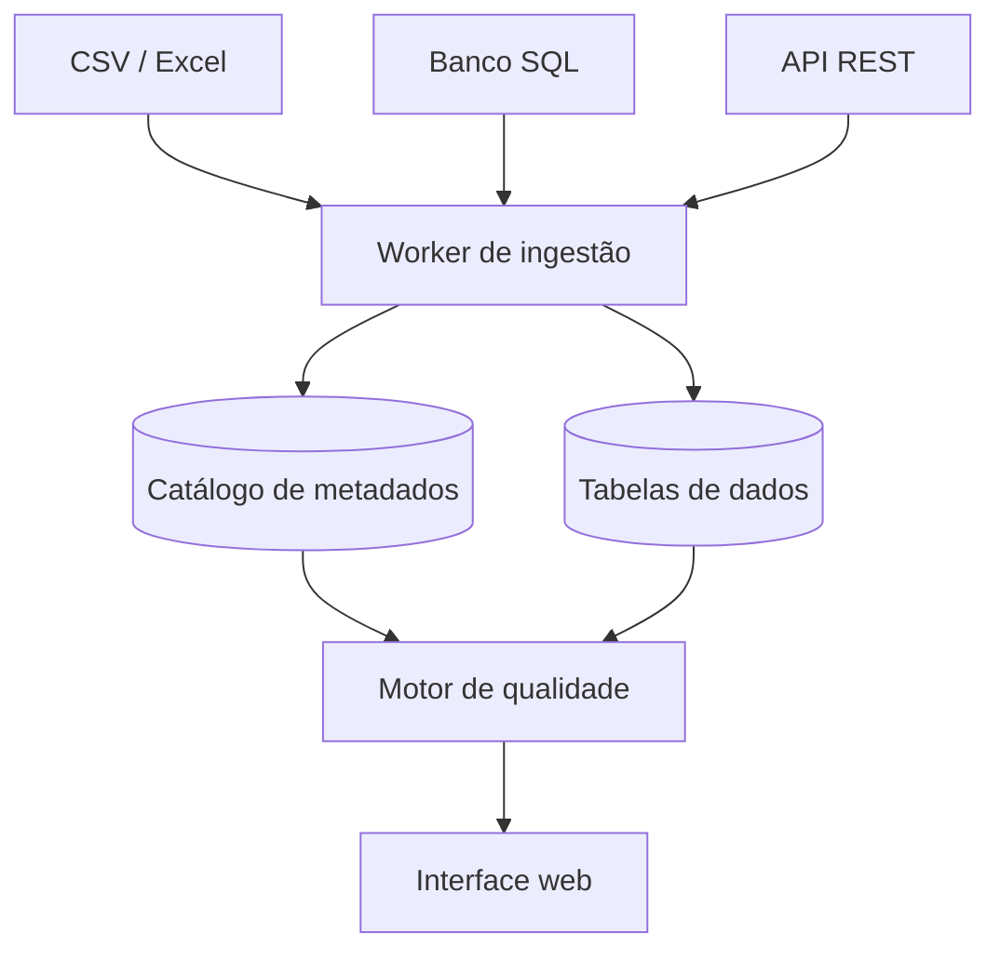

# Groma

Plataforma de catálogo e qualidade de dados em .NET 10. Ingere CSV, SQL e APIs, descobre o schema sozinha, versiona mudanças e roda regras de qualidade a cada carga.

> O nome vem da *groma*, o instrumento de agrimensura romano: uma cruz com fios de prumo usada para alinhar e medir o terreno antes de qualquer construção começar. É o papel de um catálogo de dados.

> [!NOTE]
> Projeto em construção. A estrutura da solution está no ar; a primeira fatia funcional (ingestão de CSV) está em desenvolvimento. Veja o [roadmap](#roadmap).

## O problema

Todo time que trabalha com dados convive com as mesmas perguntas sem resposta rápida: de onde veio essa tabela, o que significa essa coluna, por que o número de hoje não bate com o de ontem, e quem vai quebrar se eu mudar isso aqui.

Groma responde essas perguntas automaticamente. Você cadastra uma fonte, e a plataforma passa a manter o catálogo, o perfil estatístico e o histórico de qualidade dela sozinha.

## O que faz

- **Ingestão com descoberta de schema** — lê arquivos e bases sem configuração prévia de colunas ou tipos
- **Versionamento de schema** — cada carga compara com a anterior e registra coluna nova, coluna removida ou tipo alterado
- **Profiling de colunas** — nulos, distintos, mínimo, máximo, desvio e os valores mais frequentes, calculados a cada carga
- **Regras de qualidade** — validações configuráveis que rodam a cada ingestão, com preview de quantas linhas quebrariam antes de salvar a regra
- **Histórico e alertas** — série temporal das métricas, para distinguir um estado normal de uma degradação
- **Linhagem** — grafo de dependência entre datasets, para responder "se eu mexer aqui, o que quebra?"

## Como funciona



O worker nunca escreve direto na interface. Ele grava metadados e dados, e o motor de qualidade roda em cima do que foi gravado — o que permite reprocessar perfis e regras sem reingerir o arquivo.

## Stack

| Camada | Tecnologia |
| --- | --- |
| Runtime | .NET 10, C# |
| API | ASP.NET Core, Minimal APIs |
| Background | Worker Service |
| Catálogo | PostgreSQL com EF Core |
| Dados ingeridos | PostgreSQL com Dapper e `COPY` binário |
| Testes | xUnit, Testcontainers |
| Observabilidade | Serilog, Seq |

A persistência é dividida de propósito: o catálogo tem schema fixo e conhecido em tempo de compilação, onde o EF Core é ideal; as tabelas de dados têm schema descoberto em runtime, onde SQL gerado com Dapper é o caminho.

## Estrutura

```
groma/
├── src/
│   ├── Groma.Domain/           # regras de negócio, zero dependências
│   ├── Groma.Application/      # casos de uso e contratos
│   ├── Groma.Infrastructure/   # EF Core, Dapper, readers, profiling
│   ├── Groma.Api/              # host HTTP
│   └── Groma.Worker/           # host de background
├── tests/
│   ├── Groma.Domain.Tests/
│   ├── Groma.Application.Tests/
│   └── Groma.IntegrationTests/
└── docs/
    ├── adr/                    # decisões de arquitetura
    └── modelo-dados.md
```

Regra de dependência:

```
Groma.Api ─────┐
               ├──► Infrastructure ──► Application ──► Domain
Groma.Worker ──┘
```

A documentação completa da estrutura está em [`docs/`](docs/).

## Rodando localmente

Pré-requisitos: [.NET 10 SDK](https://dotnet.microsoft.com/download) e [Docker](https://www.docker.com/products/docker-desktop/).

```bash
git clone https://github.com/SEU_USUARIO/groma.git
cd groma

docker compose up -d      # Postgres e Seq
dotnet build
dotnet test
```

A API sobe com:

```bash
dotnet run --project src/Groma.Api
```

E o worker, em outro terminal:

```bash
dotnet run --project src/Groma.Worker
```

| Serviço | Endereço |
| --- | --- |
| API | http://localhost:5000 |
| Seq (logs) | http://localhost:5341 |
| Postgres | localhost:5432 |

## Roadmap

O projeto avança em fatias verticais, cada uma entregando algo que funciona ponta a ponta.

- [ ] **1. Ingerir um CSV** — reader, inferência de schema, DDL dinâmico e bulk load
- [ ] **2. Profiling** — perfil estatístico das colunas e tela de detalhe do dataset
- [ ] **3. Regras de qualidade** — motor de avaliação, regras built-in e preview
- [ ] **4. Assíncrono e histórico** — worker, agendamento e histórico de execuções
- [ ] **5. Versionamento de schema** — diff entre versões
- [ ] **6. Conectores SQL e REST** — novas fontes atrás da mesma abstração
- [ ] **7. Linhagem** — grafo de dependência entre datasets

## Licença

MIT
